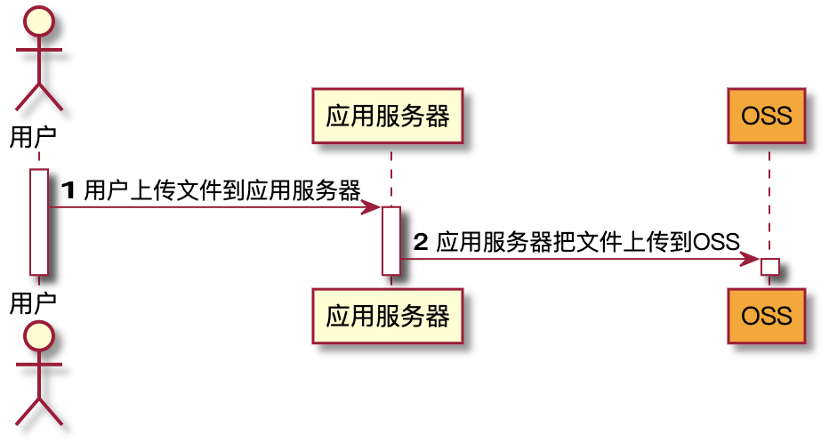

# 阿里OSS前端直传方案
## 背景

每个OSS的用户都会用到上传服务。Web端常见的上传方法是用户在浏览器或App端上传文件到应用服务器，应用服务器再把文件上传到OSS。具体流程如下图所示。



和数据直传到OSS相比，以上方法有三个缺点：

- 上传慢：用户数据需先上传到应用服务器，之后再上传到OSS。网络传输时间比直传到OSS多一倍。如果用户数据不通过应用服务器中转，而是直传到OSS，速度将大大提升。而且OSS采用BGP带宽，能保证各地各运营商之间的传输速度。
- 扩展性差：如果后续用户多了，应用服务器会成为瓶颈。
- 费用高：需要准备多台应用服务器。由于OSS上传流量是免费的，如果数据直传到OSS，不通过应用服务器，那么将能省下几台应用服务器。

## 方案

- [OSS Browser.js SDK](https://www.alibabacloud.com/help/zh/doc-detail/64041.htm?spm=a2c63.p38356.879954.5.424a3095oAbtmE#concept-64041-zh)
- [PostObject接口](https://www.alibabacloud.com/help/zh/doc-detail/31988.htm?spm=a2c63.p38356.879954.6.424a3095oAbtmE#reference-smp-nsw-wdb)

### 两种方案的优缺点

Browser.js SDK优点是可以利用官方提供的封装好的SDK使用简单，说明文档相对比较完整。缺点是会把AccessKeyId和AccessKeySecret暴露在前端，安全性极低

PostObject的方式分为两种：
- 第一种为前端直接进行签名直传，这种方式和Browser.js SDK的缺点同样明显，就是会把AccessKeyId和AccessKeySecret暴露在前端
- 第二种为服务端签名前端直传的方式。这也是我们最终选择的方案，流程如下图


## 二次封装Element UI Upload组件实现OSS服务端签名前端直传

```javascript
import Upload from 'element-ui/lib/upload'
import axios from 'axios'
import { uuidv4 } from './util'
// import { uuidv4, getPolicyBase64, getSignature } from './util'
// import config, { POLICY_INFO_SESSION_KEY } from './config'
import { POLICY_INFO_SESSION_KEY } from './config'
import http from './http'
import storage from '../utils/storage'

function MOSSUpload (WrappedComponent) {
  return {
    name: 'MOSSUpload',
    props: {
      ...WrappedComponent.props,
    },
    created () {
      // 记录每次上传的文件
      this._uploadFile = null
      // 初始化上传所需data
      this._ossParams = {
        key: '',
        name: '',
        policy: '',
        OSSAccessKeyId: '',
        signature: '',
        success_action_status: '200',
        host: '',
      }
    },
    mounted () {
      this.$nextTick(() => {
        // 原有方法proxy
        const methods = Object.keys(Upload.methods)
        methods.forEach((item) => {
          this[item] = this.$refs['m-oss-upload'][item]
        })
      })
    },
    methods: {
      async _getOSSParams () {
        // 后端签名，前端直传
        const info = storage.session.get(POLICY_INFO_SESSION_KEY, {})
        let expire = 0
        if (info.expire) {
          expire = Number(info.expire) * 1000
        }
        let params = info
        // 已过期
        if (expire - Date.now() < 1000 * 20) {
          try {
            const { data } = await http.get('/v1/oss/policy')
            const _ossParams = data.data
            storage.session.set(POLICY_INFO_SESSION_KEY, _ossParams)
            params = _ossParams
          } catch (error) {
            console.error(error)
          }
        }
        return Promise.resolve(params)

        // 前端签名直传
        // const policy = getPolicyBase64()
        // return {
        //   policy,
        //   signature: getSignature(policy),
        //   host: config.uploadImageUrl,
        //   accessid: config.OSSAccessKeyId,
        // }
      },
      async _beforeUpload (file) {
        // props 含有 beforeUpload 优先执行.支持promise
        if (this.$props.beforeUpload) {
          try {
            const ret = await this.$props.beforeUpload(file)
            if (!ret) return Promise.reject(ret)
          } catch (error) {
            return Promise.reject(error)
          }
        }
        try {
          const _ossParams = await this._getOSSParams()
          const suffix = file.type.split('/')[1]
          this._uploadFile = file
          this._ossParams.key = `${_ossParams.dir}${uuidv4()}-${+new Date()}.${suffix}`
          this._ossParams.name = file.name
          this._ossParams.policy = _ossParams.policy
          this._ossParams.OSSAccessKeyId = _ossParams.accessid
          this._ossParams.signature = _ossParams.signature
          this._ossParams.host = _ossParams.host
          this._ossParams.success_action_status = '200'
          return Promise.resolve(this._ossParams)
        } catch (error) {
          this.$message.error(error.message)
          return Promise.reject(error)
        }
      },
      _onSuccess (response, file, fileList) {
        file.$key = this._ossParams.key
        if (typeof this.onSuccess === 'function') {
          this.onSuccess(response, file, fileList)
        }
      },
      _doUpload () {
        const { host, ...rest } = this._ossParams
        const fd = new FormData()
        for (const key in rest) {
          fd.append(key, rest[key])
        }
        fd.append('file', this._uploadFile)
        return axios.post(host, fd, {
          headers: {
            'Content-Type': 'multipart/form-data',
          },
        })
      },
      renderUpload (h) {
        const slots = Object.keys(this.$slots)
          .reduce((result, name) => {
            return result.concat(this.$slots[name])
          }, [])
          .map(vnode => {
            vnode.context = this._self
            return vnode
          })
        return h(WrappedComponent, {
          ref: 'm-oss-upload',
          props: {
            ...this.$props,
            beforeUpload: this._beforeUpload,
            onSuccess: this._onSuccess,
            httpRequest: this._doUpload,
          },
          on: this.$listeners,
          scopedSlots: this.$scopedSlots,
          attr: this.$attrs,
        }, slots)
      },
    },
    render (h) {
      return h('div', {
        class: 'm-oss-upload',
      }, [
        this.renderUpload(h),
      ])
    },
  }
}

export default MOSSUpload(Upload)
```

因为项目是基于Element UI开发的，所以使用[HOC](http://hcysun.me/2018/01/05/%E6%8E%A2%E7%B4%A2Vue%E9%AB%98%E9%98%B6%E7%BB%84%E4%BB%B6/)的形式对el-upload进行封装，这样的好处即可以把OSS的业务逻辑封装起来，又可以保留el-upload的所有API

## 一些辅助的Utils

bytes.js 将字符串字节（如1KB）转换为字节（1024）
```javascript
const formatThousandsRegExp = /\B(?=(\d{3})+(?!\d))/g

const formatDecimalsRegExp = /(?:\.0*|(\.[^0]+)0+)$/

const map = {
  b: 1,
  kb: 1 << 10,
  mb: 1 << 20,
  gb: 1 << 30,
  tb: Math.pow(1024, 4),
  pb: Math.pow(1024, 5),
}

const parseRegExp = /^((-|\+)?(\d+(?:\.\d+)?)) *(kb|mb|gb|tb|pb)$/i

function bytes (value, options) {
  if (typeof value === 'string') {
    return parse(value)
  }

  if (typeof value === 'number') {
    return format(value, options)
  }

  return null
}

function format (value, options) {
  if (!Number.isFinite(value)) {
    return null
  }

  const mag = Math.abs(value)
  const thousandsSeparator = (options && options.thousandsSeparator) || ''
  const unitSeparator = (options && options.unitSeparator) || ''
  const decimalPlaces = (options && options.decimalPlaces !== undefined) ? options.decimalPlaces : 2
  const fixedDecimals = Boolean(options && options.fixedDecimals)
  let unit = (options && options.unit) || ''

  if (!unit || !map[unit.toLowerCase()]) {
    if (mag >= map.pb) {
      unit = 'PB'
    } else if (mag >= map.tb) {
      unit = 'TB'
    } else if (mag >= map.gb) {
      unit = 'GB'
    } else if (mag >= map.mb) {
      unit = 'MB'
    } else if (mag >= map.kb) {
      unit = 'KB'
    } else {
      unit = 'B'
    }
  }

  const val = value / map[unit.toLowerCase()]
  let str = val.toFixed(decimalPlaces)

  if (!fixedDecimals) {
    str = str.replace(formatDecimalsRegExp, '$1')
  }

  if (thousandsSeparator) {
    str = str.replace(formatThousandsRegExp, thousandsSeparator)
  }

  return str + unitSeparator + unit
}

function parse (val) {
  if (typeof val === 'number' && !isNaN(val)) {
    return val
  }

  if (typeof val !== 'string') {
    return null
  }

  const results = parseRegExp.exec(val)
  let floatValue
  let unit = 'b'

  if (!results) {
    floatValue = parseInt(val, 10)
    unit = 'b'
  } else {
    floatValue = parseFloat(results[1])
    unit = results[4].toLowerCase()
  }

  return Math.floor(map[unit] * floatValue)
}

export default bytes
```

utils.js
```javascript
import { Message } from 'element-ui'
import bytes from './bytes'
import axios from 'axios'

/**
 * @author houjiazong
 * @description 校验文件规格（大小，类型）
 * @param {String} maxSize 语义化定义最大值，如1kb, 1mb, 1gb, 1tb, 1pb
 * @param {String} ext 文件类型，默认为支持所有(*)，也可校验多种, 如'.png,.pdf,'
 * @param {String} errorMsg 校验不通过所提示的错误信息，支持占位符替换，如'文件大小不能超过%ms%, 所选文件大小%fs%, 允许文件类型为%ext%, 实际文件类型%fsext%'
 * @returns {Boolean} 校验是否通过
 */
export function checkFileSpecs ({
  maxSize,
  ext = '*',
  errorMsg = '文件大小不能超过%ms%, 所选文件大小%fs%, 允许文件类型为%ext%, 实际文件类型%fsext%',
}) {
  return file => {
    if (!(file instanceof File)) {
      return Message.error('校验对象必须为File对象')
    }
    const { name: fileName, size: fileSize } = file
    // 处理文件类型
    // 将传递的ext转换为数组
    const accpectExt = ext.split(',').map(item => item.trim())
    // 获取文件类型
    const fileExt = fileName.substr(fileName.lastIndexOf('.')).toLowerCase()
    // 校验文件类型是否符合定义的规则
    const validateExt = accpectExt.some(item => item === '*' || fileExt === item)

    // 处理文件大小
    // 将传入maxSize统一转换为字符串
    const maxSizeByte = bytes(maxSize)

    const fileSizeStr = bytes(fileSize)

    // 生成错误信息
    const info = {
      ms: maxSize,
      fs: fileSizeStr,
      ext,
      fsext: fileExt,
    }
    const msg = errorMsg.replace(/%(.*?)%/g, (str, key) => {
      return info[key] || str
    })
    if (!validateExt) {
      Message.warning(msg)
      return false
    }
    const validateSize = maxSizeByte > file.size
    if (!validateSize) {
      Message.warning(msg)
      return false
    }
    return true
  }
}

/**
 * @author houjiazong
 * @description 本地下载
 * @param {Object} data
 * @param {String} filename
 * @param {String} mime 类型
 * @param {Object} bom 数据头
 */
export function download (data, filename = 'download', mime = 'application/octet-stream', bom) {
  const blobData = (typeof bom !== 'undefined') ? [bom, data] : [data]
  const blob = new Blob(blobData, { type: mime })

  if (typeof window.navigator.msSaveBlob !== 'undefined') {
    window.navigator.msSaveBlob(blob, filename)
  } else {
    const blobURL = window.URL.createObjectURL(blob)
    const tempLink = document.createElement('a')
    tempLink.style.display = 'none'
    tempLink.href = blobURL
    tempLink.setAttribute('download', filename)

    if (typeof tempLink.download === 'undefined') {
      tempLink.setAttribute('target', '_blank')
    }
    document.body.appendChild(tempLink)
    tempLink.click()
    document.body.removeChild(tempLink)
    window.URL.revokeObjectURL(blobURL)
  }
}

/**
 * @author houjiazong
 * @description 下载oss文件
 * @param {String} id 文件ID
 * @param {String} name 文件名称
 * @param {Boolean} save 是否执行本地下载
 * @returns {Blob | undefined} 文件流或undefined
 */
export async function ossFileDownload (id, name, save = true) {
  try {
    const response = await axios({
      url: '/v1/file/download',
      method: 'GET',
      responseType: 'blob',
      params: { id },
    })
    if (response.retCode && response.retCode === '500') {
      return
    }
    if (save) {
      download(response, name)
    } else {
      return response
    }
  } catch (error) {
    console.error(error)
  }
}

/**
 * @author houjiazong
 * @deprecated 挂载到Upload on-preview事件的下载方法
 * @param {String} idKey 文件id的key，默认值id
 * @param {String} nameKey 文件name的key, 默认值name
 * @returns {Function}
 */
export function downFileForPreview (idKey = 'id', nameKey = 'name') {
  return file => {
    if (file[idKey]) {
      return ossFileDownload(file[idKey], file[nameKey])
    }
    if (file.raw) {
      return download(file.raw, file[nameKey])
    }
  }
}

/**
 * @author houjiazong
 * @description 根据本地文件对象或服务端返回的文件信息生成base64，可用作本地预览
 * @param {Object} data 可以为File对象或服务端返回的文件信息{id: id, name: name}
 * @param {String} idKey 文件id的key，默认值id
 * @param {String} nameKey 文件name的key, 默认值name
 * @returns {Promise}
 */
export async function ossFileToBase64 (data, idKey = 'id', nameKey = 'name') {
  let _data
  if (data instanceof File) {
    _data = data
  } else {
    try {
      _data = await ossFileDownload(data[idKey], data[nameKey], false)
    } catch (error) {
      console.error(error)
      return Promise.resolve()
    }
  }
  const reader = new FileReader()
  reader.readAsDataURL(_data)
  return new Promise((resolve, reject) => {
    reader.onload = function () {
      resolve(this.result)
    }
    reader.onerror = function () {
      reject(this.error)
    }
  })
}
```

将所有Utils挂载到Vue原型下

```javascript
import {
  downFileForPreview,
  ossFileDownload,
  ossFileToBase64,
  checkFileSpecs,
} from '@/utils/utils'

export default {
  install: Vue => {
    // 可以赋值给组件的on-preview（点击文件列表中已上传的文件时的钩子），可以进行文件的下载
    Vue.prototype.$downFileForPreview = downFileForPreview
    // OSS文件下载
    Vue.prototype.$ossFileDownload = ossFileDownload
    // 将OSS文件或本地文件对象转为Base64
    Vue.prototype.$ossFileToBase64 = ossFileToBase64
    // 校验文件规格（大小，类型）
    Vue.prototype.$checkFileSpecs = checkFileSpecs
  },
}
```

最终的一个小🌰
```html
<template>
  <el-card>
    <m-oss-upload
      class="upload-demo"
      :on-preview="handlePreview"
      :on-remove="handleRemove"
      :before-upload="$checkFileSpecs({
        maxSize: '500kb',
        ext: '.png, pdf',
        errorMsg: '文件大小不能超过%ms%, 所选文件大小%fs%, 允许文件类型为%ext%, 实际文件类型%fsext%'
      })"
      multiple
      :limit="3"
      :on-exceed="handleExceed"
      :file-list="fileList">
      <el-button size="small" type="maiaPlain">点击上传</el-button>
      <div slot="tip" class="el-upload__tip">只能上传jpg/png文件，且不超过500kb</div>
    </m-oss-upload>
  </el-card>
</template>
```
```javascript
export default {
  data () {
    return {
      fileList: [],
    }
  },
  methods: {
    handleRemove (file, fileList) {
      console.log(file, fileList)
    },
    handlePreview (file) {
      console.log(file)
    },
    handleExceed (files, fileList) {
      this.$message.warning(`当前限制选择 3 个文件，本次选择了 ${files.length} 个文件，共选择了 ${files.length + fileList.length} 个文件`)
    },
  },
}
</script>
```
